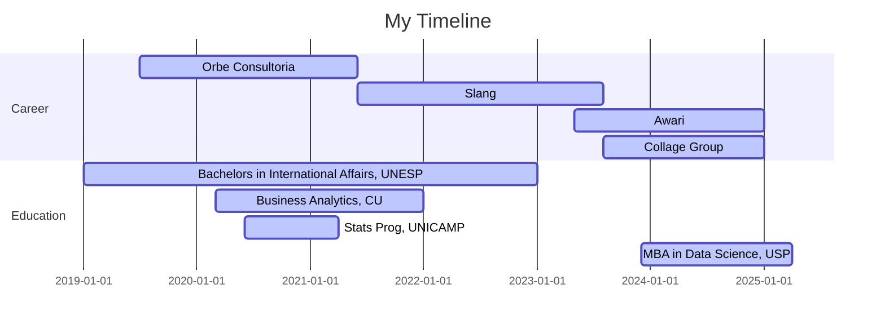

    
 #  Hey, I'm Vinícius ARZ or VARZ 

## &#x1f1e7;&#x1f1f7; Data Scientist working with Decision Intelligence and Market Intelligence at International Businesses

###  <a href="https://www.varzdecisions.com/">varzdecisions.com</a>

###  <a href="https://viniciusarz.medium.com/subscribe">**Decoding Decision Intelligence Newsletter**!</a> 

International Affairs Bachelor Self-taught Coding, Statistics and Data Science, currently building Analytics Solutions for Directors and Clients at an US based Market Research Company. Performing Analytics and providing recommendations regarding customer behaviour, market intelligence and culture influence to Fortune 500 companies.
 

 
  
  
  <a href="https://www.varzdecisions.com/" target="_blank">

 

    
<a 
   href="https://www.credly.com/badges/f73093e4-3f04-4428-a441-ac7a01735f3a/public_url"
   target="_blank" 
   title="Badge Google Data Analytics Professional Certificate" 
   alt="Google Data Analytics Professional Certificate">
   
<a 
   href="https://www.cloudskillsboost.google/public_profiles/9af929d6-d7f2-44a9-9060-33057a77a5c0/badges/6011604"
   target="_blank" 
   title="Badge Generative AI Fundamentals" 
   alt="Badge Generative AI Fundamentals">
   

## Articles

